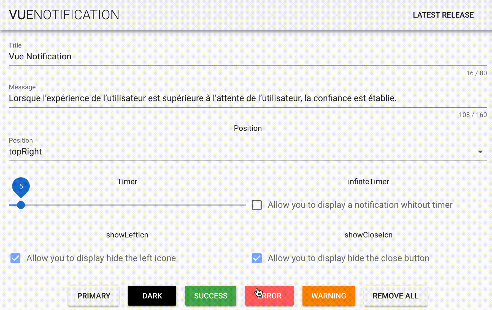
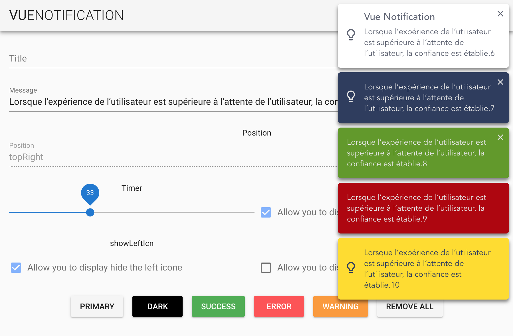

# Notification Vue JS 🚀

The **Notification vue** plugin allows you to display notifications from anywhere within your app. Just with one line of code.
This notification plugin is unique from others as it utilises the GSAP library allowing you to animate your notifications in a near limitless number of ways




## How to use it

Install with npm. If you don't already have GSAP in your project, you also have to install it.
```console
npm i @kugatsu/vuenotification --save
npm i gsap --save
```

Import with ES6

```javascript
import VueNotification from "@kugatsu/vuenotification";

Vue.use(VueNotification, {
  timer: 20
});
```

Emit the notification where you want.

```javascript
this.$notification.new("hello world", {  timer: 10 });
this.$notification.error("hello world", { infiniteTimer: false });
...
```

## Parameters

| Name          | Type     |                 Default value |
| ------------- | -------- | ----------------------------: |
| message       | String   | "🚧 You missed something ..." |
| title         | String   |                          null |
| timer         | Number   |                          5(s) |
| infiniteTimer | Boolean  |                         false |
| position      | String   |                      topRight |
| type          | String   |                       primary |
| [type]        | Object   |          ( See type section ) |
| showLeftIcn   | Boolean  |                          true |
| showCloseIcn  | Boolean  |                         false |
| animateIn     | Function |              ()=> TimelineMax |
| animateOut    | Function |              ()=> TimelineMax |

#### position

| Name          |        Value |
| ------------- | -----------: |
| top center    |    topCenter |
| top left      |      topLeft |
| top right     |     topRight |
| bottom center | bottomCenter |
| bottom left   |   bottomLeft |
| bottom right  |  bottomRight |

#### Type

There are 5 notifications types.

- primary
- dark
- success
- warning
- error

To custom the colors of the notification you can do this globally or locally :

```javascript
// Sample to change all error notifications
Vue.use(NotificationVuejs, {
  error: {
    background: "green",
    color: "red"
  }
});
```

#### Animation

To animate the in and out animation, we use **GSAP**. To customize the default animation, you have to add to your config object. animateIn and animateOut with a function that returns a gsap timeline.

```javascript
Vue.use(NotificationVuejs, {
  animateIn: function() {
    var tl = new TimelineMax()
      .from(this.notificationEl, 0.6, {
        opacity: 0
      })
      .from(this.notificationEl, 0.4, {
        borderRadius: 100,
        width: 58,
        height: 58
      })
      .from(this.notificationElContent, 0.3, {
        opacity: 0
      });
    return tl;
  }
});
```

You can select the notification with a custom selector.

| Selector                        |                Value to use |
| ------------------------------- | --------------------------: |
| all notification                |           this.notification |
| current notification            |         this.notificationEl |
| all content of the notification |  this.notificationElContent |
| Notification title              |      this.notificationTitle |
| Notification message            |    this.notificationMessage |
| Notification icone              |      this.notificationIcone |
| Notification close button       | this.notificationIconeClose |

## Credit

### Icones

<div>Icons made by <a href="https://www.flaticon.com/authors/pixel-perfect" title="Pixel perfect">Pixel perfect</a>, <a href="https://www.flaticon.com/authors/smashicons" title="Smashicons">Smashicons</a> from <a href="https://www.flaticon.com/" 			    title="Flaticon">www.flaticon.com</a> is licensed by <a href="http://creativecommons.org/licenses/by/3.0/" 			    title="Creative Commons BY 3.0" target="_blank">CC 3.0 BY</a></div>
